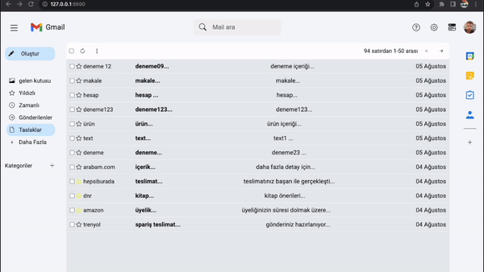

# yapılacaklar

- still düzenlemesi

- ekran boyutu 1100 px altında side bar kapalı gelsin

- formun boş gönderilmesi halinde bildirim ver mail gönderme

- sil butonu aktif edilecek
- - silinen maili localstorage'dan sil

- yıldızlama özelliğini aktif et 
- - sidebar daki yıldızlananlara tıklanınca yıldızlı olanları göster

- sidebar kısmındaki kategorileri js tarafından html e gönder
- - tıklanılan katgorinin arka planını mavi yap

- arama çubuğunu aktif et
- - inputa yazılan yazıyı al ve mailllerin içeriğile eşleşenleri ekrana bas
 
  

